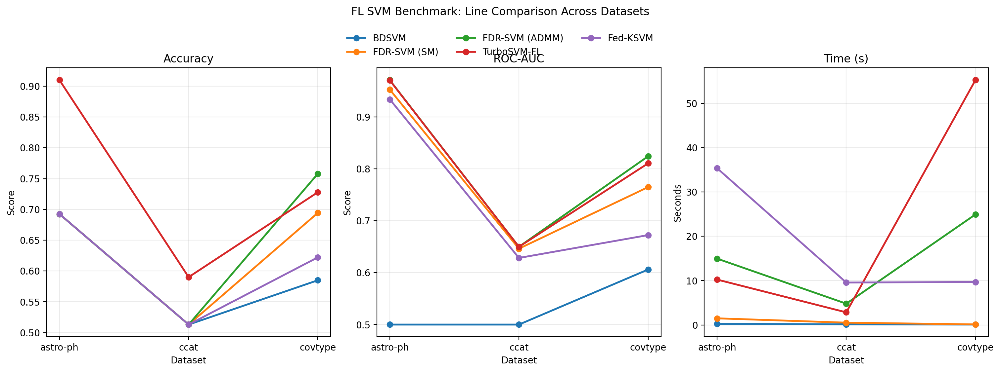

| Algorithm | Type | astro-ph Acc | astro-ph AUC | ccat Acc | ccat AUC | covtype Acc | covtype AUC | Avg Time(s) |
|-----------|------|-------------|--------------|----------|----------|-------------|-------------|-------------|
| BDSVM | Primal | 0.6924 | 0.5000 | 0.5130 | 0.5000 | 0.5849 | 0.6060 | 0.16 |
| FDR-SVM (SM) | Primal | 0.6924 | 0.9529 | 0.5130 | 0.6463 | 0.6943 | 0.7649 | 0.71 |
| FDR-SVM (ADMM) | Primal-Dual | 0.6924 | 0.9712 | 0.5130 | 0.6499 | 0.7578 | 0.8243 | 14.90 |
| TurboSVM-FL | Mixed | 0.9099 | 0.9708 | 0.5900 | 0.6498 | 0.7278 | 0.8107 | 22.77 |
| Fed-KSVM | Primal | 0.6924 | 0.9341 | 0.5130 | 0.6284 | 0.6221 | 0.6724 | 18.21 |

## Line Comparison Chart

